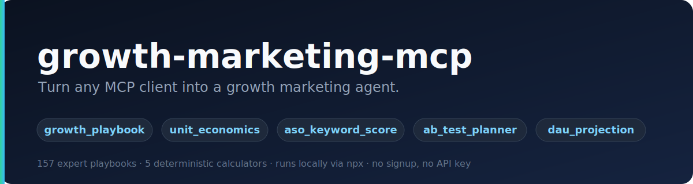
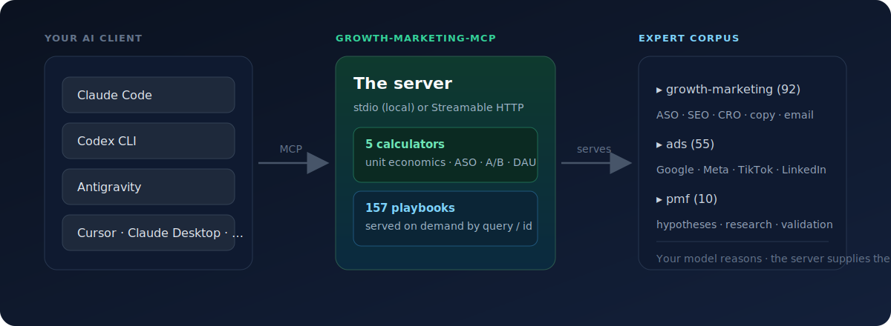

<p align="center">
  
</p>

<p align="center">
  <a href="#install"></a>
  
  
  
</p>

# growth-agent-mcp

Turn any MCP-compatible AI assistant into a **growth marketing agent** — Claude Code, Codex, Antigravity, Cursor, Claude Desktop, Windsurf, Cline, and more.

This server bundles **Growth Prophet's proprietary growth playbooks** (157 across ASO, SEO, CRO, paid ads, content, PMF, retention, pricing, and sales) and serves them to your model on demand, alongside deterministic growth calculators. Your own model does the reasoning; this server supplies the expert playbooks and the math.

> **Zero cost, no signup, no API key.** Runs locally via `npx`. No data leaves your machine.

---

## Quickstart

Pick your client — all four use the same `npx` command, no install step.

| Client | One-liner |
|--------|-----------|
| **Claude Code** | `claude mcp add growth-agent -- npx -y growth-agent-mcp` |
| **Codex CLI** | `codex mcp add growth-agent -- npx -y growth-agent-mcp` |
| **Antigravity** | paste the [JSON](#antigravity) into `mcp_config.json` |
| **Cursor** | paste the [JSON](#cursor) into `mcp.json` |

Then just ask your assistant a growth question — it calls the tools automatically:

> *"Is my CAC of $300 healthy if ARPU is $50/mo at 80% margin and 5% monthly churn?"*

Full setup for each client is in [Install](#install) below.

---

## See it in action

The model picks the right tool and gets back structured, deterministic results. These are **real outputs** from the server:

**`unit_economics`** — *"Is my CAC of $300 healthy if ARPU is $50/mo at 80% margin and 5% monthly churn?"*

```
# Unit Economics

**Results**
- **LTV** (gross-margin adjusted): $800
- **LTV : CAC** = 2.67 : 1 — ⚠️ thin (1–3)
- **CAC payback**: 7.5 months — ✅ <12mo

> Benchmarks: LTV:CAC ≥ 3:1 and CAC payback < 12 months are the common
> SaaS health bars. Below 1:1 you lose money per customer.
```

**`ab_test_planner`** — *"How long to run an A/B test on my 4% signup rate to catch a 15% lift at 3k visitors/day?"*

```
# A/B Test Plan

**Required sample**
- **Per variant: 17,940** conversions-eligible visitors
- **Total: 35,880** across all variants

**Estimated duration**
- At 3,000 visitors/day (1,500/variant): **~12 days**

> Don't peek-and-stop: fixing the sample size up front keeps the 5%
> false-positive rate honest.
```

**`growth_playbook`** — *"Find me a playbook for reducing checkout abandonment"*

```
Found 6 matching playbook(s) in "growth-marketing":

1. **Form CRO**            · id: growth-marketing-form-cro
2. **Signup Flow CRO**     · id: growth-marketing-signup-flow-cro
3. **Churn Prevention**    · id: growth-marketing-churn-prevention
…
→ Call growth_playbook again with `id` set to the best match to load the full playbook.
```

The agent then loads the full playbook by `id` and applies it to your situation.

---

## How it works

<p align="center">
  
</p>

A typical agent loop for *"help me grow my app"*:

1. `growth_playbook({ query: "app store keyword optimization" })` → ranked matches
2. `growth_playbook({ id: "growth-marketing-aso" })` → full ASO playbook
3. `aso_keyword_score({ keywords: [...] })` → prioritized keyword list
4. `ab_test_planner({ baselineRatePct: 4, mdeRelativePct: 15, dailyVisitorsTotal: 3000 })` → experiment sizing

Or just run the `/growth-audit` prompt and let it orchestrate the whole thing.

---

## What's inside

### 5 tools

| Tool | What it does |
|------|--------------|
| `growth_playbook` | Retrieves expert growth playbooks on demand. No args → catalog; `query` (+ optional `group`) → ranked search; `id` → full playbook. |
| `unit_economics` | LTV, LTV:CAC ratio, CAC payback period, ROAS from CAC/ARPU/margin/churn. Pure math. |
| `aso_keyword_score` | Ranks app store keywords by opportunity = volume × relevance ÷ difficulty. |
| `ab_test_planner` | Required sample size per variant + test duration from baseline rate, MDE, power, significance. |
| `dau_projection` | Cohort-summed DAU projection from D1/D30/D180 retention via a piecewise power-law curve. Returns LT30, LT180, and a milestone table. |

### Playbook corpus (served by `growth_playbook`)

157 playbooks across 3 discipline groups:

- **growth-marketing** (92) — ASO, Apple Search Ads, SEO (technical/AI/programmatic/schema), CRO (page/signup/onboarding/popup/form/paywall), copywriting & content, paid ads, cold email, email sequences, lead magnets, referral, launch, free-tool strategy, churn prevention, pricing, RevOps, sales enablement, competitor/alternatives, analytics, A/B setup, marketing psychology.
- **ads** (55) — multi-platform paid ads audits + deep dives (Google, Meta, TikTok, LinkedIn, Microsoft, Apple, YouTube), creative, landing, budget, competitor, brand DNA, generation, planning.
- **pmf** (10) — product-market-fit hypothesis building, market research, research synthesis, validation.

### 4 prompts (slash commands)

| Prompt | What it does |
|--------|--------------|
| `growth-audit` | Full-funnel growth audit — the agent pulls playbooks, runs the calculators, and returns ranked levers + a 30-day experiment plan. |
| `competitor-analysis` | JSON competitor positioning + battlecard. |
| `pmf-validation` | V1 PMF hypothesis across 6 dimensions with DVF assumptions and validation briefs. |
| `growth-loop-design` | 2–3 self-reinforcing growth loops with a 30-day validation experiment. |

Prompts appear as slash commands in clients that support MCP prompts (Claude Code, Claude Desktop).

---

## Install

> Before this package is published to npm, follow [Local development](#local-development) and point your client at the local build instead of `npx`.

### Claude Code

```bash
claude mcp add growth-agent -- npx -y growth-agent-mcp
```

Run `/mcp` to confirm it's connected. See [`examples/claude-code.md`](examples/claude-code.md) for example prompts.

### Codex CLI

```bash
codex mcp add growth-agent -- npx -y growth-agent-mcp
```

Or add it to `~/.codex/config.toml` directly ([`examples/codex.toml`](examples/codex.toml)):

```toml
[mcp_servers.growth-agent]
command = "npx"
args = ["-y", "growth-agent-mcp"]
```

Start a session and run `/mcp` to verify.

### Antigravity

In the Agent panel, open **… (Additional Options) → MCP Servers → Manage MCP Servers → View raw config**, then add the server to `mcpServers` ([`examples/antigravity.json`](examples/antigravity.json)):

```json
{
  "mcpServers": {
    "growth-agent": {
      "command": "npx",
      "args": ["-y", "growth-agent-mcp"]
    }
  }
}
```

The raw config lives at `~/.gemini/antigravity/mcp_config.json` (macOS/Linux) or `C:\Users\<USERNAME>\.gemini\antigravity\mcp_config.json` (Windows). Restart Antigravity after saving.

### Cursor

Add to `~/.cursor/mcp.json` (global) or `.cursor/mcp.json` (per-project) ([`examples/cursor.json`](examples/cursor.json)):

```json
{
  "mcpServers": {
    "growth-agent": {
      "command": "npx",
      "args": ["-y", "growth-agent-mcp"]
    }
  }
}
```

Enable it under **Settings → MCP**.

### Claude Desktop

Edit `claude_desktop_config.json` (macOS: `~/Library/Application Support/Claude/claude_desktop_config.json`) with the same `mcpServers` block as Cursor above ([`examples/claude-desktop.json`](examples/claude-desktop.json)), then restart Claude Desktop.

### Windsurf / other MCP clients

Any client that speaks MCP over stdio works — use the same `command` / `args` pair. See [`examples/windsurf.json`](examples/windsurf.json).

---

## Remote server / Claude connector

The same server runs over the MCP **Streamable HTTP** transport, so you can host it once and add it as a **Claude custom connector** (or connect any remote MCP client). Deploy it anywhere that runs Node or Docker, then use the public `https://…/mcp` URL.

### Run it

```bash
npm run build
npm run start:http          # listens on :3000, POST /mcp
# optional: require a token
GROWTH_AGENT_TOKEN=secret PORT=8080 npm run start:http
```

Or with Docker (deploys cleanly to Railway, Render, Fly, Cloud Run, a VPS, …):

```bash
docker build -t growth-agent-mcp .
docker run -p 3000:3000 growth-agent-mcp
# with auth: docker run -e GROWTH_AGENT_TOKEN=secret -p 3000:3000 growth-agent-mcp
```

Endpoints: `POST /mcp` (the MCP endpoint), `GET /health`, `GET /` (info).

### Add it as a connector

- **claude.ai** (web/desktop): Settings → Connectors → **Add custom connector** → paste your `https://your-host/mcp` URL.
- **Claude Code**: `claude mcp add --transport http growth-agent https://your-host/mcp`
- **Antigravity** (remote): use `"serverUrl": "https://your-host/mcp"` instead of `command`/`args`.

If you set `GROWTH_AGENT_TOKEN`, supply it as a `Bearer` token in the client's auth/header configuration. The server is stateless and safe to scale horizontally. It stores no user data — it only serves playbooks and runs math.

---

## Local development

```bash
npm install
npm run build       # tsc → dist/
npm run smoke       # drive the stdio server with a real MCP client (14 checks)
npm run smoke:http  # boot the HTTP server and drive it over Streamable HTTP
```

Point a client at the local build:

```json
{
  "mcpServers": {
    "growth-agent": {
      "command": "node",
      "args": ["/absolute/path/to/growth-agent-mcp/dist/index.js"]
    }
  }
}
```

### Refreshing the corpus

`npm run sync -- <SKILLS_DIR>` copies every growth skill's markdown into `data/playbooks/` and regenerates `data/catalog.json`. Pass the source `.claude/skills` directory as the argument (or set `GROWTH_SKILLS_DIR`). This is an internal maintenance step — end users never need it; the corpus ships prebuilt.

---

## License

MIT © Growth Prophet
